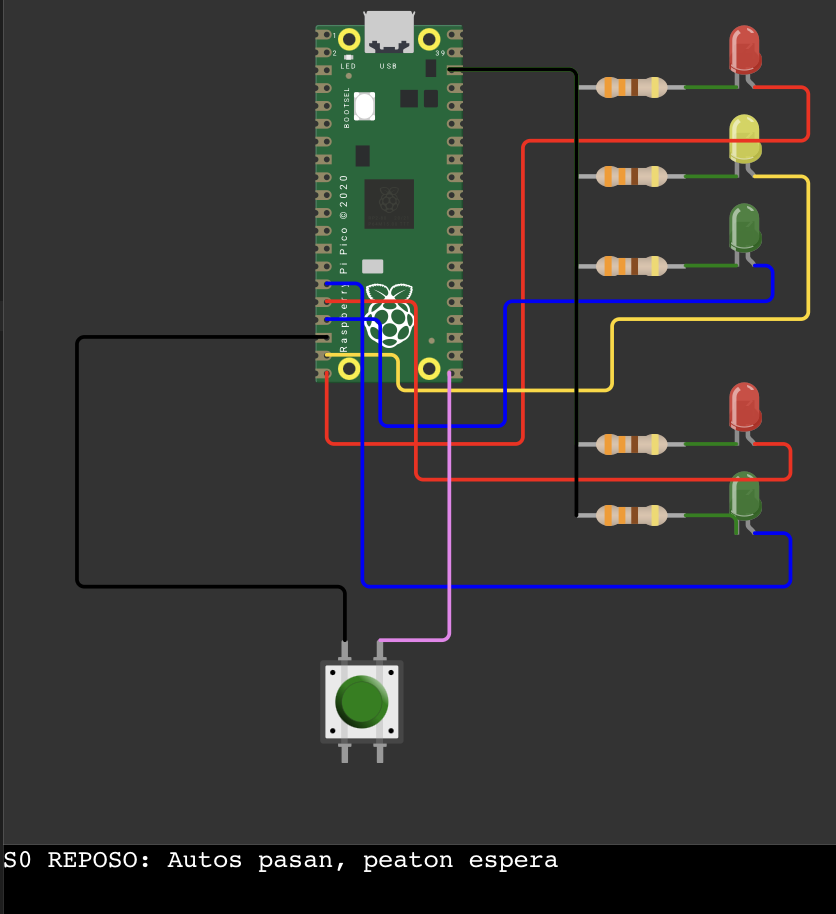
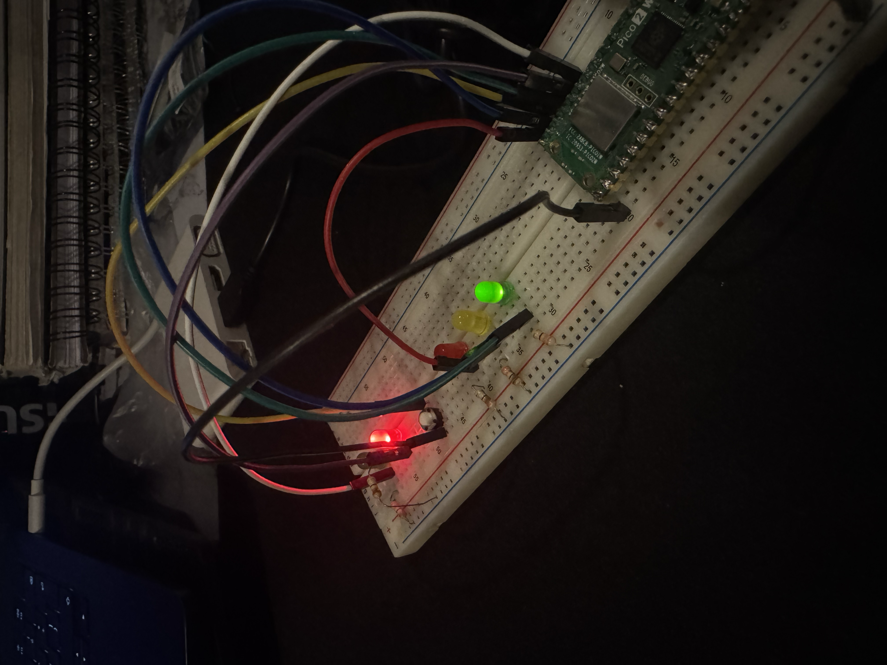

# Link del video
https://youtu.be/GcFuO7eJdIo

# Sesión 03 - GPIO Pull-up / Pull-down

## Objetivo

Configurar una entrada digital de la Raspberry Pi Pico con resistencia de **pull-up interna** para leer el estado de un botón sin usar una resistencia externa, y utilizar esa entrada para controlar la secuencia de un semáforo peatonal simulado en MicroPython.

## Circuito

- 3 LEDs para el semáforo de autos: rojo, amarillo y verde.
- 2 LEDs para el semáforo peatonal: rojo y verde.
- 1 botón pulsador conectado a una entrada configurada con `Pin.PULL_UP`.

| Elemento                 | Pin GPIO |
|--------------------------|----------|
| Semáforo auto - Rojo     | 15 |
| Semáforo auto - Amarillo | 14 |
| Semáforo auto - Verde    | 13 |
| Semáforo peatón - Rojo   | 12 |
| Semáforo peatón - Verde  | 11 |
| Botón peatonal           | 16 |

## Funcionamiento

1. En reposo, el semáforo de autos permanece en verde y el de peatones en rojo.
2. Al presionar el botón (detectado por flanco de bajada con antirrebote por software), se dispara la secuencia de cruce:
   - Los autos pasan a amarillo (transición) y luego a rojo.
   - El semáforo peatonal cambia a verde para permitir el cruce.
   - Antes de finalizar, el verde peatonal parpadea como aviso.
   - Se restablece el estado de reposo (autos en verde, peatones en rojo).
3. El programa espera a que el botón se suelte antes de permitir una nueva petición.

## Pull-up/Pull-down

El botón se configuró como `Pin(BUTTON, Pin.IN, Pin.PULL_UP)`, es decir, con la resistencia de pull-up interna del microcontrolador activada:

- En reposo (botón sin presionar), la entrada queda conectada a 3.3V a través de la resistencia interna, por lo que se lee `1`.
- Al presionar el botón, este conecta la entrada a GND, por lo que se lee `0`.
- Esto evita usar una resistencia externa y evita que el pin quede "flotando" (en un estado indefinido) cuando el botón no está presionado.
- La lógica del programa está invertida respecto a un pull-down: se detecta la pulsación como un flanco de bajada (`1` → `0`).

## Pruebas realizadas

- Simulación completa del circuito en Wokwi, verificando la secuencia de luces al presionar el botón virtual.
- Armado físico del circuito con LEDs, resistencias y botón, cargando el script en una Raspberry Pi Pico.
- Verificación de que el semáforo de autos y el de peatones nunca queden en verde al mismo tiempo.
- Pruebas de pulsaciones rápidas y sostenidas del botón para validar el antirrebote.

## Problemas encontrados

- El boton estaba mal colocado y por ende no funcionaba el boton.

## Conclusión

El uso de la resistencia de pull-up interna permitió simplificar el circuito al eliminar la necesidad de una resistencia externa, manteniendo una lectura estable y confiable del botón. La práctica ayudó a comprender la diferencia entre configuraciones pull-up y pull-down, así como la importancia del antirrebote por software para evitar lecturas erróneas en entradas digitales.

# Evidencia

## Autor

Jonathan Hernández Lazcano - 200417
