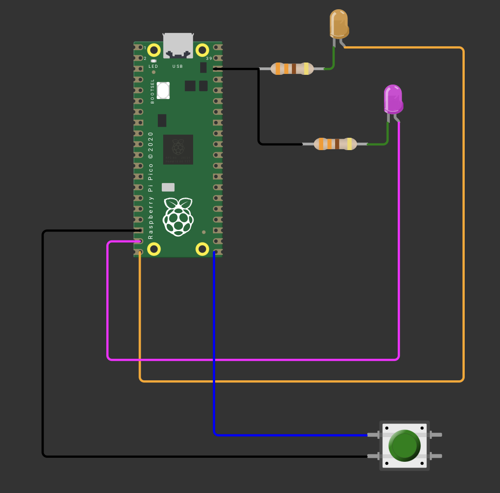
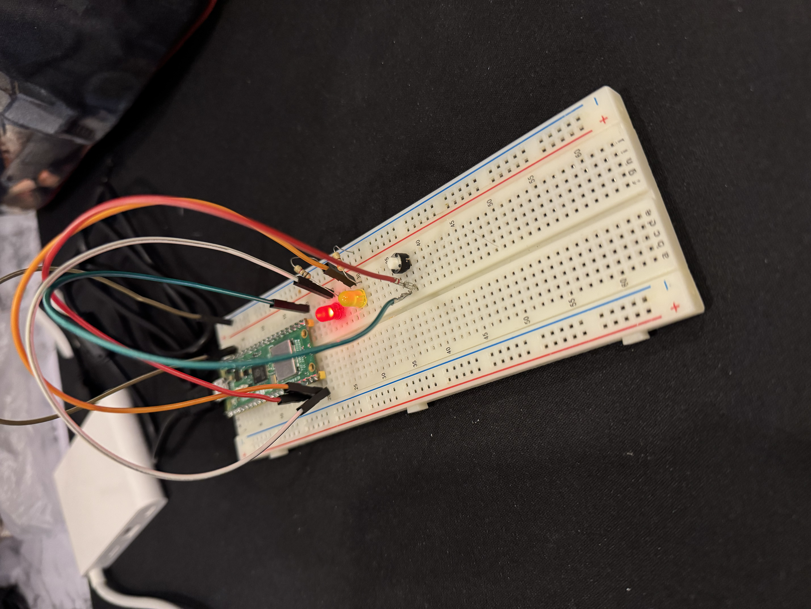
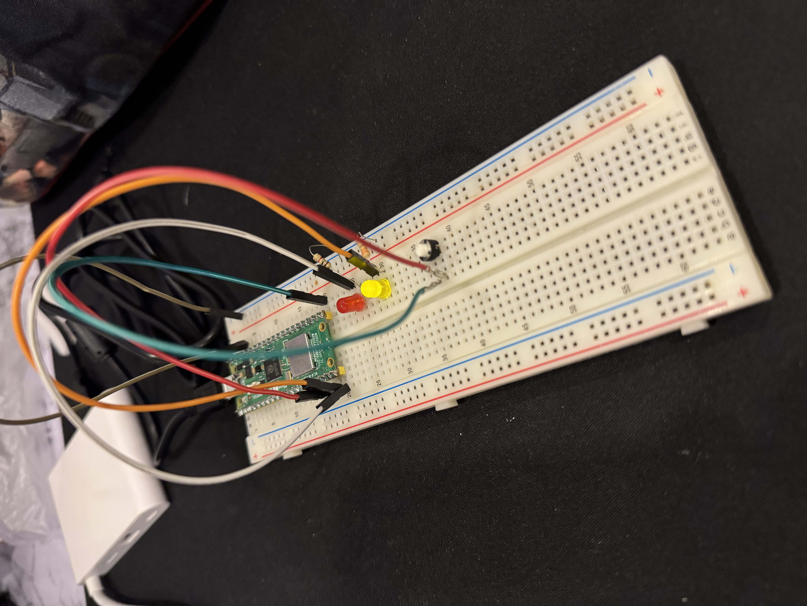
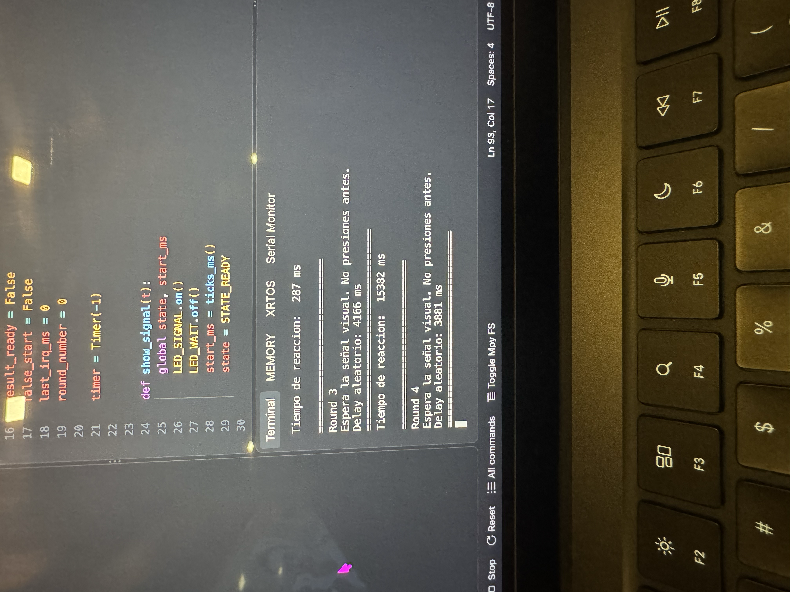

# Link del video
https://youtube.com/shorts/Winyt-tXFpY

# Sesión 04 - Interrupciones y Temporizadores

Juego de reflejos en MicroPython sobre Raspberry Pi Pico: mide el tiempo de reacción del jugador usando una interrupción por hardware y un temporizador en modo *one-shot*.

## 1. Objetivo

Medir el tiempo de reacción de una persona utilizando una **interrupción por hardware** (`Pin.irq`) para capturar el instante exacto de la pulsación y un **temporizador** (`machine.Timer`) en modo *one-shot* para generar un retardo aleatorio antes de la señal visual, evitando el uso de sondeo (*polling*) bloqueante en la medición.

## 2. Circuito

- 1 LED de señal: se enciende cuando el jugador debe reaccionar.
- 1 LED de espera: indica que la ronda está en curso y aún no debe presionarse el botón.
- 2 resistencias de 330 Ω en serie con los LEDs.
- 1 botón pulsador conectado a una entrada con `Pin.PULL_UP` (el otro extremo va a GND).

| Elemento               | Pin GPIO |
|------------------------|----------|
| LED de señal (naranja) | 15 |
| LED de espera (magenta)| 14 |
| Botón                  | 16 |

### Funcionamiento

1. Al iniciar, se programa una ronda: se apaga el LED de señal, se enciende el LED de espera y se sortea un retardo aleatorio entre **1000 y 10000 ms** con `randint()`.
2. Ese retardo se carga en un `Timer` en modo `Timer.ONE_SHOT`. El programa **no se bloquea** esperando: el temporizador dispara solo su callback cuando vence.
3. Al vencer el temporizador, el callback `show_signal()` enciende el LED de señal, apaga el de espera y guarda la marca de tiempo de inicio con `ticks_ms()`.
4. Cuando el jugador presiona el botón, la interrupción por flanco de bajada ejecuta `button_irq()`, que calcula el tiempo transcurrido con `ticks_diff()` y lo reporta por consola.
5. Si el botón se presiona **antes** de que aparezca la señal, se cancela el temporizador con `timer.deinit()` y la ronda se marca como **salida en falso**.
6. Tras mostrar el resultado, el programa espera a que el botón se suelte y programa automáticamente la siguiente ronda.

### Máquina de estados

El programa se organiza en tres estados que determinan cómo debe interpretarse una pulsación:

| Estado | Significado | Efecto de presionar el botón |
|--------|-------------|------------------------------|
| `STATE_WAITING` | Retardo aleatorio en curso, LED de espera encendido | Salida en falso: se cancela el temporizador |
| `STATE_READY`   | Señal visible, cronómetro corriendo | Se mide y registra el tiempo de reacción |
| `STATE_DONE`    | Ronda terminada, mostrando resultado | Se ignora |

## 3. Qué es una interrupción

Una **interrupción** es una señal que obliga al microcontrolador a detener momentáneamente lo que está ejecutando para atender un evento externo. Cuando ocurre el evento, el procesador guarda su estado actual, ejecuta una función especial llamada **rutina de servicio de interrupción (ISR)** y, al terminar, retoma el programa exactamente donde se quedó.

La alternativa es el **sondeo (*polling*)**: revisar el pin una y otra vez dentro del bucle principal. El sondeo desperdicia tiempo de CPU y, sobre todo, introduce un error de medición igual al periodo con el que se revisa el pin. Con interrupción, el evento se atiende en cuanto ocurre.

**Cómo se usa en esta práctica:**

```python
BUTTON.irq(trigger=Pin.IRQ_FALLING, handler=button_irq)
```

- El botón está en `PULL_UP`, así que al presionarlo el pin pasa de `1` a `0`: por eso el disparo es por **flanco de bajada** (`IRQ_FALLING`).
- El microcontrolador atiende la pulsación sin importar qué esté haciendo el bucle principal, lo que hace la medición mucho más precisa que con sondeo.
- El manejador se mantiene **corto**: solo lee `ticks_ms()`, calcula la diferencia y cambia banderas. La impresión por consola y las esperas se dejan al bucle principal, porque dentro de una ISR no conviene realizar operaciones lentas o que reserven memoria.
- El **antirrebote** se resuelve dentro de la propia interrupción: se descartan los disparos que ocurran a menos de **80 ms** del anterior, comparando con `ticks_diff(now, last_irq_ms)`.

## 4. Qué es un temporizador

Un **temporizador (*timer*)** es un periférico que cuenta pulsos de reloj de forma independiente al programa y genera un evento cuando alcanza un valor determinado. Permite ejecutar una acción después de cierto tiempo, o de forma periódica, **sin bloquear** la ejecución: a diferencia de `sleep()`, el procesador queda libre para seguir trabajando mientras la cuenta avanza.

En MicroPython tiene dos modos:

- `Timer.ONE_SHOT`: dispara el callback **una sola vez** al cumplirse el periodo.
- `Timer.PERIODIC`: lo dispara de forma repetida cada periodo.

**Cómo se usa en esta práctica:**

```python
timer = Timer(-1)
timer.init(mode=Timer.ONE_SHOT, period=delay_ms, callback=show_signal)
```

- `Timer(-1)` crea un temporizador virtual (por software) del RP2040.
- Se usa el modo `ONE_SHOT` porque cada ronda necesita un único retardo impredecible antes de mostrar la señal.
- Al ser asíncrono, el retardo no congela el programa: el botón sigue siendo atendido durante la espera, que es precisamente lo que permite detectar las salidas en falso.
- `timer.deinit()` cancela el temporizador pendiente cuando la ronda se invalida.

**`ticks_ms()` / `ticks_diff()`:** se usa `ticks_diff()` en lugar de una resta directa porque el contador de milisegundos de MicroPython es circular y se desborda; `ticks_diff()` maneja correctamente ese desbordamiento.

## 5. Resultados en ms

Mediciones obtenidas en cinco rondas consecutivas por la reaccion de un Gamer profesional:

| Intento | Tiempo (ms) | Observación |
|---------|-------------|-------------|
| 1 | 287 | Reaccione un poco tarde |
| 2 | 264 | Buen tiempo de reaccion |
| 3 | 296 | Mi peor tiempo |
| 4 | 271 | Mas o menos mi tiempo promedio |
| 5 | 258 | Mejor tiempo que obtube |

### Resumen

| Mejor tiempo | Peor tiempo | Promedio | Salidas en falso |
|--------------|-------------|----------|------------------|
| 258 ms | 296 ms | 275.2 ms | 0 |

Los cinco tiempos se mantienen en un rango estrecho (258–296 ms), consistente con el tiempo de reacción visual típico de una persona.

### Pruebas realizadas

- Simulación del circuito completo en Wokwi
- Armado físico del circuito en protoboard con la Raspberry Pi Pico, los dos LEDs con sus resistencias y el botón, ejecutando el mismo script.
- Verificación de que el retardo aleatorio cambia en cada ronda y se mantiene dentro del rango de 1 a 10 segundos.
- Medición de tiempos de reacción en rondas consecutivas, comprobando que los valores son coherentes (cientos de milisegundos).
- Prueba de salida en falso presionando el botón durante el LED de espera, confirmando que el temporizador se cancela y la ronda se invalida.
- Pulsaciones rápidas y sostenidas para validar el antirrebote de 80 ms y la espera de liberación del botón antes de la siguiente ronda.

## 6. Problemas encontrados

- Sin antirrebote, una sola pulsación generaba varias interrupciones y se registraban tiempos falsos; se resolvió filtrando por tiempo dentro del manejador con `ticks_diff()`.
- Mantener el botón presionado al terminar una ronda disparaba de inmediato la siguiente como salida en falso; se corrigió esperando a que el pin regrese a `1` antes de programar la nueva ronda.

## 7. Conclusión

El uso de interrupciones permitió medir el tiempo de reacción con una precisión que no sería posible con sondeo, ya que la captura del instante de la pulsación no depende de la velocidad del bucle principal. El temporizador en modo *one-shot* aportó el retardo aleatorio sin bloquear la ejecución, dejando al microcontrolador libre para atender el botón durante la espera y detectar así las salidas en falso. La práctica también dejó claro por qué un manejador de interrupción debe ser breve y por qué el antirrebote sigue siendo necesario incluso trabajando por hardware.

# Evidencia

**Diagrama del circuito en Wokwi**


**Armado físico en protoboard**



**Monitor serie durante la partida**


## Archivos

- [`Wokwi_Micropython/Reaction_Game.py`](Wokwi_Micropython/Reaction_Game.py) — programa principal
- [`Wokwi_Micropython/Diagrama.json`](Wokwi_Micropython/Diagrama.json) — circuito para Wokwi

## Autor

Jonathan Hernández Lazcano - 200417
