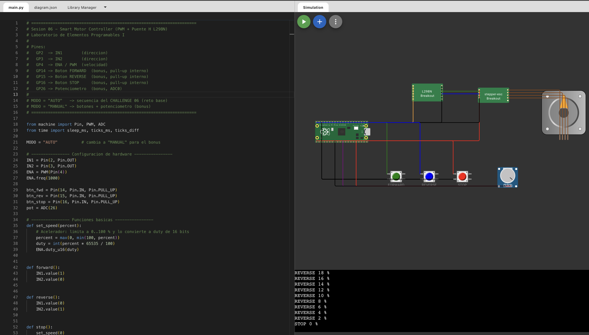

# Sesión 06 · PWM + Puente H L298N + Motor DC

**Laboratorio de Elementos Programables I**
Smart Motor Controller en MicroPython sobre una Raspberry Pi Pico. 

---

## 1. Objetivo

Controlar un motor DC con la Pico a través de un puente H L298N. No basta con que el motor gire: hay que controlar **cómo llega a cada estado**, con dirección, velocidad por PWM, rampas de aceleración y desaceleración, y un cambio seguro de dirección.

---

## 2. ¿Qué es PWM?

**PWM (Pulse Width Modulation)** consiste en encender y apagar una salida digital muy rápido para controlar la **energía promedio** que recibe una carga.

- La salida del GPIO **no** se vuelve un voltaje analógico. Sigue alternando entre **0 V y 3.3 V**.
- Lo que cambia es el **duty cycle**, es decir, el porcentaje del tiempo que la señal permanece en alto.

```
0 %    ______________________
50 %   ‾‾‾‾|____|‾‾‾‾|____|‾‾‾‾
100 %  ‾‾‾‾‾‾‾‾‾‾‾‾‾‾‾‾‾‾‾‾‾‾
```

| Duty cycle | Energía promedio | En el motor |
|---|---|---|
| 0 % | Nula | Detenido |
| 25 % | Baja | Velocidad baja |
| 50 % | Media | Velocidad media |
| 100 % | Máxima | Velocidad máxima |

En MicroPython el duty se configura con `duty_u16()` en un rango de 16 bits (0 a 65535):

```python
duty = int(percent * 65535 / 100)
ENA.duty_u16(duty)
```

Se usa una frecuencia de **1000 Hz** (`ENA.freq(1000)`).

---


## 3. Mapa de pines

| Pico | L298N / Componente | Función |
|---|---|---|
| GP2 | IN1 | Dirección |
| GP3 | IN2 | Dirección |
| GP4 | ENA | Velocidad (PWM) |
| GND | GND | Tierra común |
| GP14 | Botón FORWARD | Bonus (pull-up interno) |
| GP15 | Botón REVERSE | Bonus (pull-up interno) |
| GP16 | Botón STOP | Bonus (pull-up interno) |
| GP26 | Potenciómetro (ADC0) | Bonus: velocidad manual |

---

## 4. IN1 / IN2 / ENA

**IN1 / IN2 indican hacia dónde gira el motor:**

| IN1 | IN2 | Motor |
|---|---|---|
| 0 | 0 | STOP |
| 1 | 0 | FORWARD |
| 0 | 1 | REVERSE |
| 1 | 1 | Freno / STOP |

**ENA indica qué tan rápido gira:** recibe la señal PWM, así que su duty cycle define la velocidad.

En el código cada acción tiene su propia función, para que el programa se lea como un controlador y no como una lista de 0 y 1:

```python
forward()        # IN1=1, IN2=0
reverse()        # IN1=0, IN2=1
stop()           # velocidad 0, IN1=0, IN2=0
set_speed(75)    # ENA al 75 %
ramp_to(0, 100)  # rampa de velocidad
```

---

## 5. Rampa de aceleración y desaceleración

Una rampa cambia la velocidad **poco a poco** en lugar de saltar de golpe. No es una función del motor: es un **algoritmo**, hecho con `for` + `range()`.

```python
def ramp_to(start, end, step=10, delay_ms=100):
    if start <= end:
        secuencia = range(start, end + 1, step)    # 0, 10, 20 ... 100
    else:
        secuencia = range(start, end - 1, -step)   # 100, 90, 80 ... 0
    for speed in secuencia:
        set_speed(speed)
        sleep_ms(delay_ms)
    # Si el paso no cae exacto (ej. 0 -> 75 con paso 10), se fija el valor final
    if speed != end:
        set_speed(end)
```

**Decisiones de diseño:**

- Incremento: **10 %** por paso.
- Tiempo entre pasos: **100 ms**, así que una rampa de 0 a 100 % tarda alrededor de 1 segundo.
- `start` y `end` se limitan a 0–100 %.
- Si el paso no llega exactamente al valor final, la función lo corrige. Por ejemplo, 0 → 75 termina en 75 y no en 70.

---

## 6. Cambio seguro de dirección

**Regla:** nunca invertir el giro a alta velocidad. Antes de cambiar de dirección, el motor debe pasar por **0 %**.

```
FORWARD 100 %  →  desacelerar  →  0 %  →  cambiar dirección  →  REVERSE  →  acelerar
```

Invertir de golpe provoca **picos de corriente, calentamiento del L298N y esfuerzo mecánico** en el motor y los engranes.

```python
def change_direction(new_dir, current_speed):
    ramp_to(current_speed, 0)   # 1) bajar a 0 %
    stop()                      # 2) detener
    sleep_ms(300)               # 3) pausa
    new_dir()                   # 4) nueva dirección
```

---

## 7. Funcionamiento del programa

En `main.py`, la variable `MODO` selecciona el comportamiento:

### MODO = "AUTO" (reto base, CHALLENGE 06)

1. `MOTOR STOP`
2. Prueba de velocidades a 25 %, 50 %, 75 % y 100 %
3. Ciclo repetitivo:
   - FORWARD → rampa 0 → 100 % → mantener 2 s
   - Cambio seguro de dirección (100 → 0 %)
   - REVERSE → rampa 0 → 75 % → mantener 2 s
   - Rampa 75 → 0 % → STOP

### MODO = "MANUAL" (bonus)

- Los botones **FORWARD / REVERSE / STOP** usan interrupciones (`IRQ_FALLING`) con debounce de 150 ms. La ISR solo guarda la petición, siguiendo la regla de la Sesión 04.
- El **potenciómetro** fija la velocidad objetivo (0–100 %).
- Una rampa **no bloqueante** de 2 % cada 40 ms acerca la velocidad real a la objetivo.
- Si se pide otra dirección, el motor **frena hasta 0 %** y solo después cambia de sentido.
- En Wokwi también se pueden usar las teclas **F**, **R** y **S**.

---

## 8. Plan de pruebas

> Marca cada prueba con PASS o FAIL después de probarla.

| # | Test | Resultado esperado | Wokwi | Físico |
|---|---|---|---|---|
| 1 | STOP | Motor detenido | ☐ PASS / ☐ FAIL | ☐ PASS / ☐ FAIL |
| 2 | FORWARD | Giro en sentido correcto | ☐ PASS / ☐ FAIL | ☐ PASS / ☐ FAIL |
| 3 | REVERSE | Giro en sentido contrario | ☐ PASS / ☐ FAIL | ☐ PASS / ☐ FAIL |
| 4 | 25 / 50 / 75 / 100 % | La velocidad cambia en cada nivel | ☐ PASS / ☐ FAIL | ☐ PASS / ☐ FAIL |
| 5 | Ramp UP | Incremento progresivo 0 → 100 % | ☐ PASS / ☐ FAIL | ☐ PASS / ☐ FAIL |
| 6 | Ramp DOWN | Reducción progresiva 100 → 0 % | ☐ PASS / ☐ FAIL | ☐ PASS / ☐ FAIL |
| 7 | Cambio de dirección | Primero pasa por 0 % y luego invierte | ☐ PASS / ☐ FAIL | ☐ PASS / ☐ FAIL |
| B | Bonus: botones + potenciómetro | Control manual con rampa y cambio seguro | ☐ PASS / ☐ FAIL | ☐ PASS / ☐ FAIL |

La validación en Wokwi es evidencia de la **lógica**. La prueba física es evidencia de la **implementación**.

---


## 9. Evidencia

- Simulación en Wokwi: ver [`wokwi/enlace_o_captura.md`](wokwi/enlace_o_captura.md)
- Captura de la simulación: [`evidence/Wowki_Simluacion.png`](evidence/Wowki_Simluacion.png)
- Fotos del montaje físico: [`evidence/hardware_1.jpg`](evidence/hardware_1.jpg), [`evidence/hardware_2.jpg`](evidence/hardware_2.jpg), [`evidence/hardware_3.jpg`](evidence/hardware_3.jpg)
- Video MODO AUTO: [YouTube Shorts](https://youtube.com/shorts/xu2d1WG4CZY?feature=share)
- Video MODO MANUAL: [YouTube Shorts](https://youtube.com/shorts/6QihC__thcQ?feature=share)



---

## 10. Problemas encontrados

| Problema | Causa | Solución |
|---|---|---|
| La rampa 0 → 75 terminaba en 70 % | `range()` con paso 10 no llega exactamente a 75 | Al final de `ramp_to()` se fija el valor `end` si no se alcanzó |
| El potenciómetro no daba una lectura útil en el montaje físico | Estaba mal conectado: los pines de 3.3 V / GND / señal (ADC0) no coincidían con el mapa de pines | Se revisó el cableado y se conectó cada pin del potenciómetro en su lugar correcto (3.3 V, GND y GP26/ADC0) |

---

## 11. Exit ticket

1. **¿Qué es duty cycle?** Es el porcentaje del periodo en que la señal PWM está en alto. Define la energía promedio entregada.
2. **¿Qué controla IN1/IN2?** La **dirección** de giro del motor (forward, reverse o stop).
3. **¿Qué controla ENA?** La **velocidad**, porque recibe el PWM que habilita y dosifica la potencia hacia el motor.
4. **¿Por qué usamos una rampa?** Para cambiar la velocidad de forma gradual. Así se evitan picos de corriente y golpes mecánicos, y el sistema se comporta de forma controlada.
5. **¿Por qué no invertimos dirección a alta velocidad?** Porque genera picos de corriente, calienta el puente H y somete al motor a un esfuerzo mecánico brusco. Por eso primero hay que bajar a 0 %.

---

## 12. Estructura de la carpeta

```
Sesion_06_PWM_Motor_DC/
├── README.md
├── main.py
├── wokwi/
│   ├── diagram.json
│   └── enlace_o_captura.md
└── evidence/
    ├── Wowki_Simluacion.png
    ├── hardware_1.jpg
    ├── hardware_2.jpg
    └── hardware_3.jpg
```
